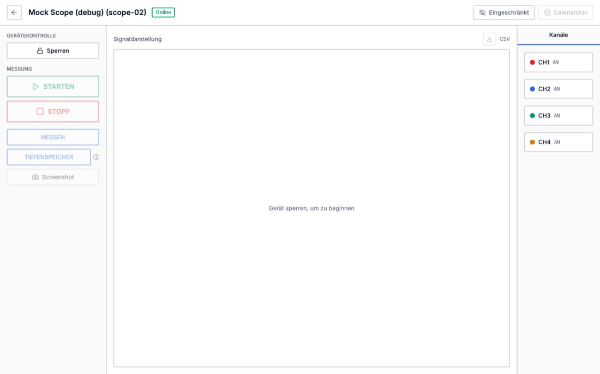
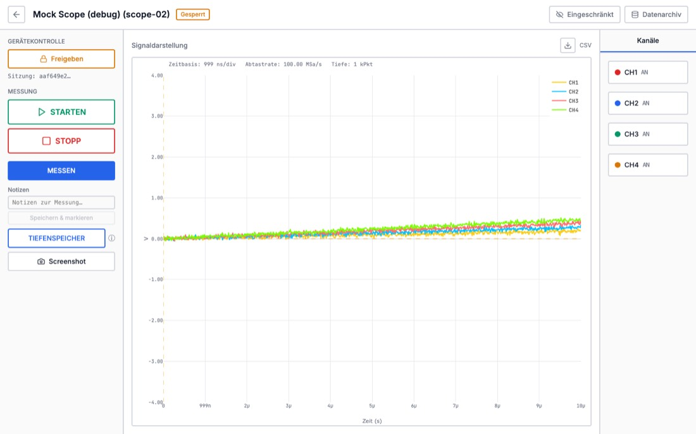
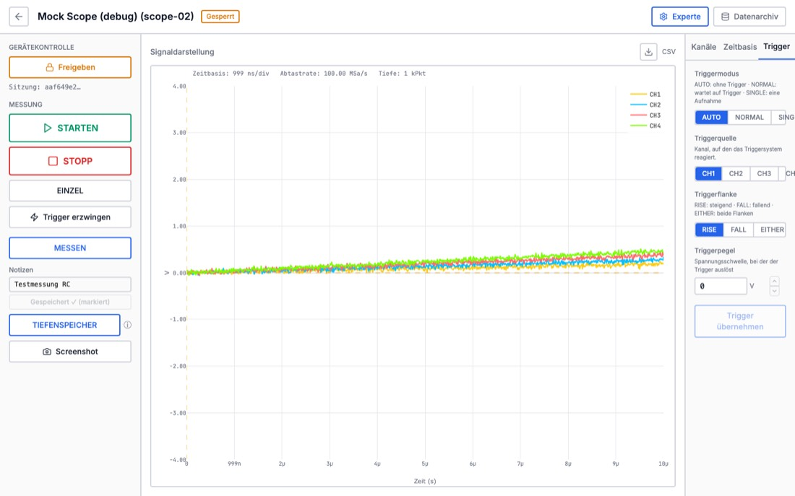
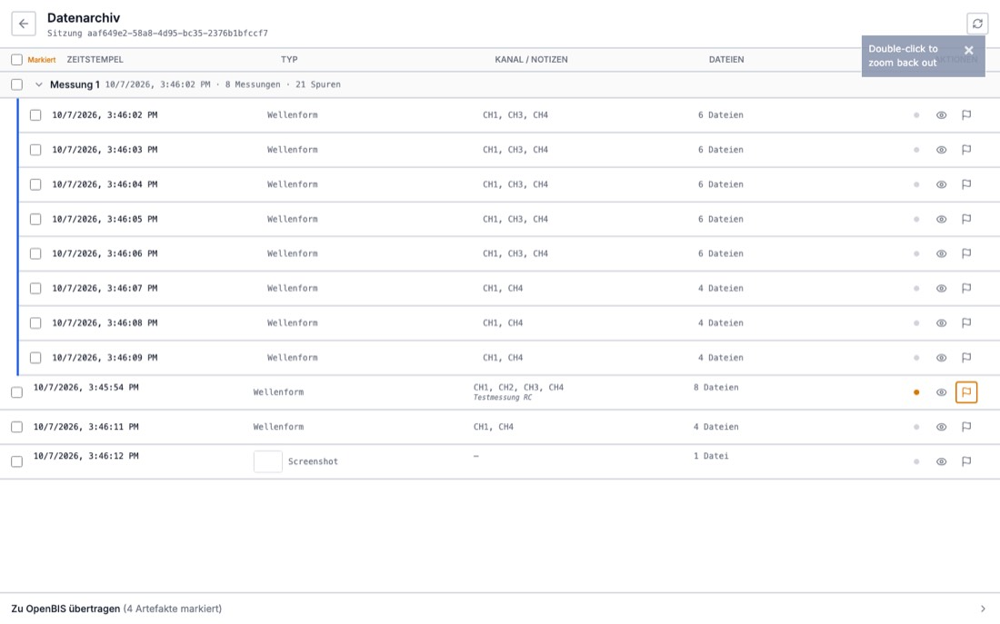
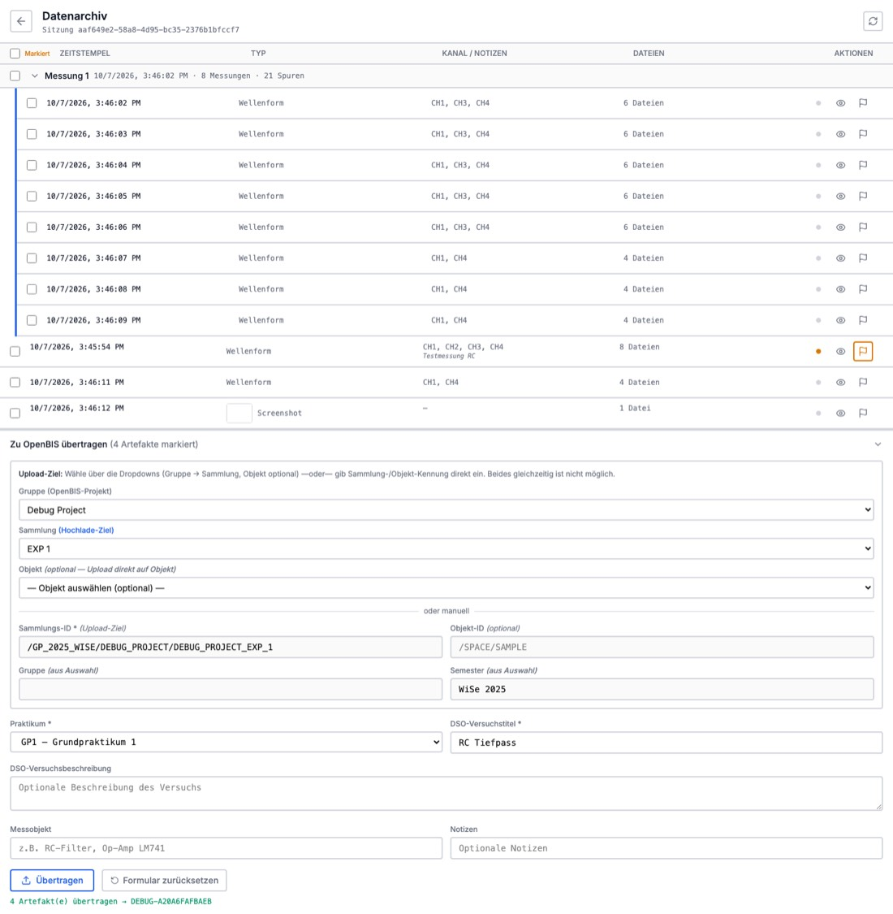
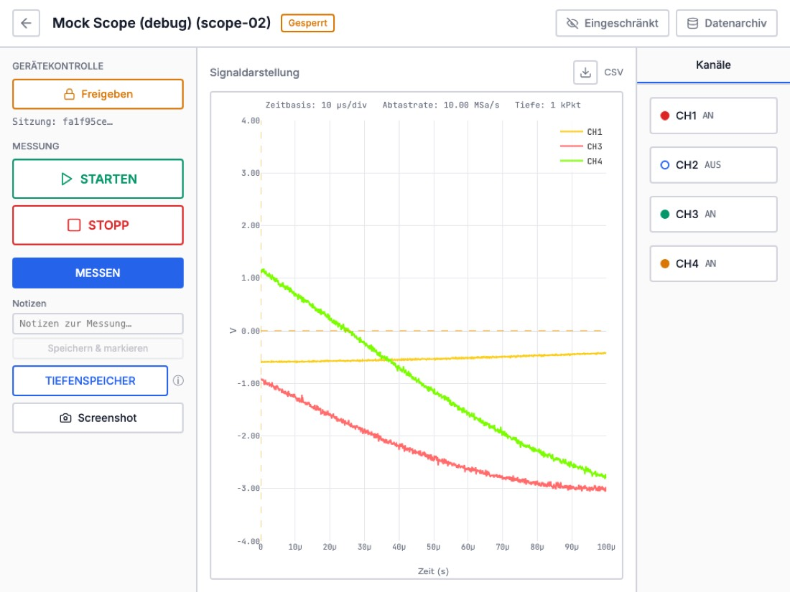
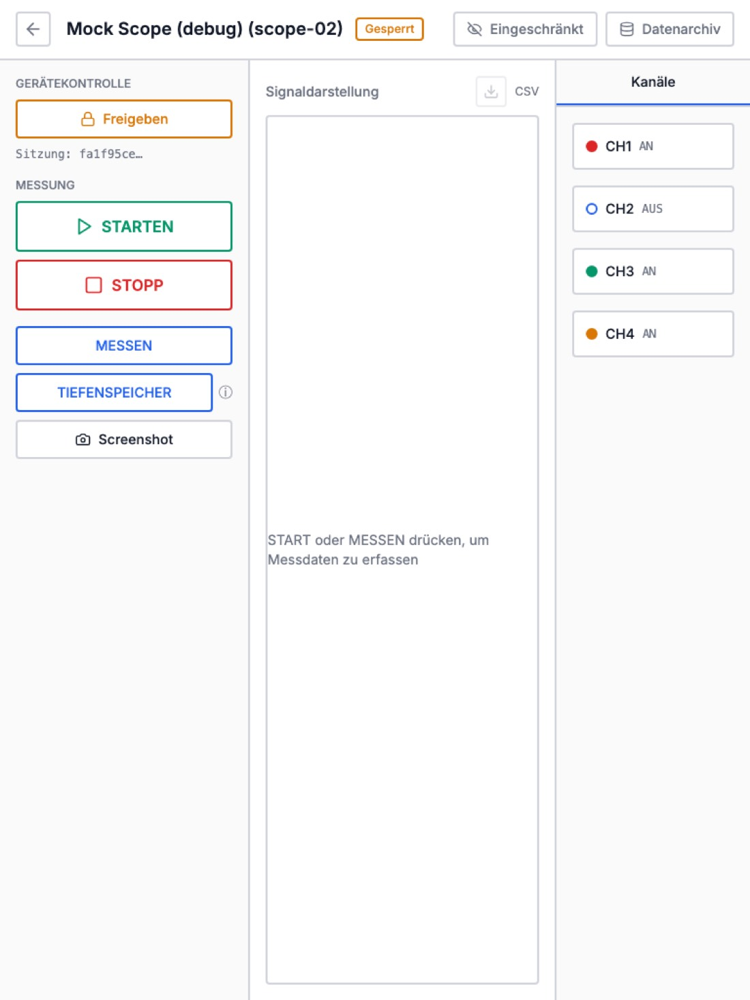

# Frontend UX/UI Review: Oscilloscope Control

**Date:** 2026-10-07 · **Version reviewed:** v0.4.0 (`dev`, commit `474eede`)
**Target users:** students in a physics lab course (GP1–GP3) with little oscilloscope or openBIS experience. Supported devices are desktop computers and tablets (landscape and portrait). Phones are out of scope.

---

## 0. How this review was done

- I read every frontend source file (`frontend/src/**`) and the backend endpoints the UI uses.
- I ran the app in `DEBUG=True` (mock driver) and used Playwright to go through every screen and interaction: login (wrong and right token), device list, lock, MESSEN, notes, expert mode, every settings tab and apply button, STARTEN/STOPP live mode, TIEFENSPEICHER, screenshot, CSV, plot zoom, the data archive (expand, preview, flag), the full openBIS commit with confirmation, back-navigation, and a second tab on the same device.
- Every screen was measured at **1440×900, 1280×800, 1024×768 (tablet landscape) and 768×1024 (tablet portrait)**. I checked horizontal overflow, the space left for the plot, and tap-target sizes.
- Where a finding says **verified**, it was reproduced in the browser, not only inferred from code.

The screenshots in this folder come from that run.

---

## 1. Executive summary

The app works end to end. The happy path (lock → measure → note → archive → upload) completed without crashes, and no page overflows horizontally at any tested size. The visual style is clean and calm. Many controls already have German help texts and tooltips. These are good foundations.

For the actual target group, though, the problems are less about looks and more about **guidance, feedback and how state is handled**:

| #   | Problem                                                                                                                                                                                                                                                 | Why it matters for students                                                                                                                      |
| --- | ------------------------------------------------------------------------------------------------------------------------------------------------------------------------------------------------------------------------------------------------------- | ------------------------------------------------------------------------------------------------------------------------------------------------ |
| 1   | **There is no guided workflow.** The steps (lock → set up → measure → note/flag → upload) are spread over two pages, with no indication of the current step or the next one.                                                                            | Students don't know what to do next. The upload is hidden in a collapsed panel at the bottom of a different page.                                |
| 2   | **Live mode (STARTEN) saves every frame to the archive.** 9 s of live view produced 8 archived acquisitions (verified).                                                                                                                                 | After a few minutes the archive holds hundreds of entries, so finding "the good one" becomes impossible. ZIP download is capped at 50 artifacts. |
| 3   | **Notes typed during live mode are wiped every second** (verified: typing "Resonanz bei 1 kHz" left "Hz", then "").                                                                                                                                     | The data loss looks like a bug, and students get frustrated.                                                                                     |
| 4   | **Numeric inputs can't take negative values by typing.** `-0.5` becomes `00.5` (verified). The V/div down-arrow stops at 0.5 V/div (verified). Arrows produce `0.30000000000000004`.                                                                    | The trigger level and offset can't be set properly. Small signals can't be scaled from the UI.                                                   |
| 5   | **Channel colours differ between the settings panel and the plot.** CH1 is red in the panel but yellow in the plot, CH2 blue vs cyan, CH3 green vs red, CH4 orange vs green.                                                                            | Students mix up channels, which is the most basic thing to get right on a scope.                                                                 |
| 6   | **Unapplied settings silently influence acquisitions and then vanish.** Turning a channel off without clicking "Übernehmen" still changes what MESSEN/live acquires, and the change is then marked as "applied".                                        | The pending/applied model can't be trusted, and the dirty markers are wrong.                                                                     |
| 7   | **Errors are tiny red text, or appear only in the console.** Flag, preview and ZIP failures go only to `console.error`. A lost lock shows one line of 12 px text in the sidebar.                                                                        | Students don't notice failures, and data quietly doesn't get flagged or uploaded.                                                                |
| 8   | **Reloading the page (F5) releases the lock** (`beforeunload` → unlock) and throws away the plot. Opening the device in a second tab gives two controlling tabs. Closing either tab unlocks both.                                                       | Accidental reloads are common on tablets. Another group may take the scope in between.                                                           |
| 9   | **The archive can't be reached once the lock is released.** The "Datenarchiv" button needs an active session, and there is no list of earlier sessions.                                                                                                 | A student who releases the device before uploading can't upload anymore.                                                                         |
| 10  | **On tablets the plot shrinks to 280 px (portrait) or 530 px (landscape)** because two fixed sidebars stay on screen. The settings panel is 200 px wide and clips the trigger controls ("SING…", "CH…") at every screen size. Tap targets are 14–24 px. | The UI is effectively unusable on a portrait tablet and hard to use on a landscape one.                                                          |

The architecture is the main obstacle to growth. `OscilloscopeControl.tsx` is a 1,200-line component with ~39 `useState` hooks. Channels are hard-coded as `ch1..ch4` in at least 8 places. Every new setting means a new state hook, a new dirty check, a new apply handler and a new hand-written panel. Section 6 proposes a structure where new scope controls, exports and analyses are **added by registering them** rather than by editing the page.

---

## 2. Screen-by-screen findings

Severity: **P1** = blocks or misleads students, or loses data · **P2** = significant friction · **P3** = polish.

### 2.1 Login (`/login`)

| Sev | Finding                                                                                                                                                                                    | Suggestion                                                                                                                                                                                              |
| --- | ------------------------------------------------------------------------------------------------------------------------------------------------------------------------------------------ | ------------------------------------------------------------------------------------------------------------------------------------------------------------------------------------------------------- |
| P1  | Students must paste a raw **openBIS session token**. Most won't know what that is or where to find it.                                                                                     | Prefer SSO. `AuthContext` already reads the `openbis` cookie and `#token=`. Add a primary button **"Mit openBIS anmelden"** that redirects to openBIS and back. Keep the token field under "Erweitert". |
| P2  | The hint "Im DEBUG-Modus: `debug-token`" is always shown, in production too ([Login.tsx:61](../../frontend/src/app/pages/Login.tsx#L61)).                                                  | Show it only when the backend reports debug mode (e.g. `GET /config` → `{debug: true}`).                                                                                                                |
| P3  | `index.html` has `lang="en"` and the title "Laboratory Oscilloscope UI", while the UI is German. The error boundary is in English ("Something went wrong").                                | Use `lang="de"` and the title "Oszilloskop-Steuerung", and translate the error boundary.                                                                                                                |
| P3  | Fonts come from Google Fonts ([fonts.css](../../frontend/src/styles/fonts.css)). Lab networks may block external CDNs, and German courts have ruled against embedding Google Fonts (GDPR). | Self-host Inter and JetBrains Mono, e.g. via `@fontsource/*`.                                                                                                                                           |

### 2.2 Device list (`/`)

What works: a clear card grid, status badges, "Gesperrt von dir", a skeleton while loading, and an empty state.

| Sev | Finding                                                                                                                                                                                                                            | Suggestion                                                                                                                                                                     |
| --- | ---------------------------------------------------------------------------------------------------------------------------------------------------------------------------------------------------------------------------------- | ------------------------------------------------------------------------------------------------------------------------------------------------------------------------------ |
| P2  | A device in `ERROR` has its "Öffnen" button disabled but **styled as active** (only `OFFLINE` gets the grey style, [DeviceCard.tsx:49-51](../../frontend/src/app/components/DeviceCard.tsx#L49-L51)). `last_error` is never shown. | Style every disabled state the same way, and show `last_error` plus "Admin informieren" on the card.                                                                           |
| P2  | When your own lock exists, the card says "Gesperrt von dir", but the button still just says "Öffnen".                                                                                                                              | Use the button label **"Fortsetzen"** (resume) when `is_mine`, "Belegt" (disabled, showing the owner and since when) when someone else holds the lock, and "Öffnen" otherwise. |
| P3  | The list polls every 5 s, although the backend already has an SSE stream (`GET /devices/events`).                                                                                                                                  | Subscribe to SSE and fall back to polling. Lock changes then show up instantly.                                                                                                |
| P3  | There is no way to reach earlier sessions or data from here (see 2.4).                                                                                                                                                             | Add a header link **"Meine Messdaten"**: a list of the user's sessions from today and their upload status.                                                                     |

### 2.3 Oscilloscope control (`/device/:id`)




#### Workflow and guidance

| Sev | Finding                                                                                                                                                                                                                             | Suggestion                                                                                                                                                                                                                                |
| --- | ----------------------------------------------------------------------------------------------------------------------------------------------------------------------------------------------------------------------------------- | ----------------------------------------------------------------------------------------------------------------------------------------------------------------------------------------------------------------------------------------- |
| P1  | Nothing tells the student the order of steps. Before locking, seven buttons are disabled with no reason given. Only the plot placeholder says "Gerät sperren, um zu beginnen".                                                      | Add a **workflow strip** below the header (see §4.1) and give every disabled button a visible reason ("Zuerst Gerät sperren").                                                                                                            |
| P1  | **"Sperren"** sounds like _blocking_ something, not _taking control_. Once locked, the button reads **"Freigeben"** in amber, which looks like a warning.                                                                           | Use **"Gerät übernehmen"** / **"Gerät freigeben"**, with a status line underneath: "Du steuerst dieses Gerät · aktiv seit 14:02".                                                                                                         |
| P1  | Releasing the lock clears the plot ([OscilloscopeControl.tsx:430](../../frontend/src/app/pages/OscilloscopeControl.tsx#L430)) and disables "Datenarchiv". **There is no warning** about data that is unflagged or not yet uploaded. | Show a confirmation dialog on release: "3 Messungen sind noch nicht hochgeladen. Jetzt hochladen / Trotzdem freigeben". Keep the archive reachable afterwards (§2.4). Also overview todays measurements, see above.                       |
| P2  | "Eingeschränkt / Experte" is a free toggle stored in `localStorage`. "Eingeschränkt" reads like an error or permission state. In that mode students **can't even switch channels on or off**.                                       | Rename the modes to **"Einfach / Erweitert"**. In _Einfach_, allow channel on/off plus an **Auto-Setup** button (scope autoscale: the single most useful control for beginners). Let admins or the course config pin the mode per course. |

#### Acquisition controls

| Sev | Finding                                                                                                                                                                                            | Suggestion                                                                                                                                                                                                                                                                                                                                                                                                                                                |
| --- | -------------------------------------------------------------------------------------------------------------------------------------------------------------------------------------------------- | --------------------------------------------------------------------------------------------------------------------------------------------------------------------------------------------------------------------------------------------------------------------------------------------------------------------------------------------------------------------------------------------------------------------------------------------------------- |
| P1  | **Live mode saves every frame** as an acquisition (one per second).                                                                                                                                | Make live mode **preview-only** (not persisted). Change main "Starten" button to "Live Preview". Add an explicit **"Aufnahme speichern"** button that saves the current frame, both while live and when stopped (If stopped, take single shot measurement. If live, stop live preview). This needs a backend flag (`persist=false` / preview endpoint). Keep the run grouping only for an explicit "Serienaufnahme" feature. "Stoppen" still stops scope. |
| P1  | **The note field is cleared on every acquisition** ([OscilloscopeControl.tsx:577](../../frontend/src/app/pages/OscilloscopeControl.tsx#L577)), so in live mode it empties every second (verified). | Attach notes only to _saved_ captures. Better still: show the note field inside a "Letzte Aufnahme" card that doesn't re-render per live frame.                                                                                                                                                                                                                                                                                                           |
| P1  | **STARTEN stays clickable while running.** Each click starts a new run ID and splits the run group. **STOPP is clickable while stopped** (both verified).                                          | Make it a single toggle (**▶ Live preview starten / ■ Live preview stoppen**). Add additional "STOP" button for hardware scope stop. "Serienaufnahme starten / stoppen".                                                                                                                                                                                                                                                                                  |
| P2  | **"EINZEL"** only sends STOP; it doesn't do a single acquisition. **"Trigger erzwingen"** does STOP+RUN and doesn't update `isRunning`. The labels promise something the code doesn't do.          | Implement real `single` and `force_trigger` driver commands (and capabilities).                                                                                                                                                                                                                                                                                                                                                                           |
| P2  | There are three "acquire" buttons with jargon names: MESSEN, TIEFENSPEICHER, Screenshot. The ⓘ tooltip is hover-only and doesn't work on tablets.                                                  | Group them as **"Aufnehmen"**: a main button "Messung speichern" with a split menu "Volle Speichertiefe (langsam)" and "Bildschirmfoto des Oszilloskops". Put the explanation in visible helper text, not only in a `title`.                                                                                                                                                                                                                              |
| P2  | TIEFENSPEICHER progress is a hard-coded time estimate (`maxDepth/600000*30*n`), there is no cancel, and the other buttons stay usable.                                                             | Use a determinate progress bar if the backend reports blocks (SSE), otherwise indeterminate with elapsed time. Add an **"Abbrechen"** button. Make sure in the backend the transfer is stopped (multiple packets from scope). Lock the other acquisition actions with the reason "Tiefenspeicher wird gelesen…".                                                                                                                                          |
| P2  | TIEFENSPEICHER is still a bit confusing. Even with the help hover next to it.                                                                                                                      | Make the workflow for the deep save multi-step with some form of expanded cards. Tell the student, what will happen, how long it will take, what can be set on the scope and why this matters.                                                                                                                                                                                                                                                            |
| P2  | Screenshot downloads immediately and saves to the archive "fire-and-forget". A failed save is swallowed, and it makes two round-trips to the device.                                               | Save once on the server, then offer "Herunterladen" from the result. Show a toast with a thumbnail: "Bildschirmfoto gespeichert".                                                                                                                                                                                                                                                                                                                         |
| P3  | Command errors (`cmdError`) appear as small red text at the bottom of the left sidebar, often off-screen on tablets.                                                                               | Use a central toast for each error, plus a persistent status bar (see §4.3).                                                                                                                                                                                                                                                                                                                                                                              |

#### Settings panel (Kanäle / Zeitbasis / Trigger



| Sev | Finding                                                                                                                                                                                                                                                                                                                                                      | Suggestion                                                                                                                                                                                                                                                                                                  |
| --- | ------------------------------------------------------------------------------------------------------------------------------------------------------------------------------------------------------------------------------------------------------------------------------------------------------------------------------------------------------------ | ----------------------------------------------------------------------------------------------------------------------------------------------------------------------------------------------------------------------------------------------------------------------------------------------------------- |
| P1  | **NumericInput is broken for real input** ([NumericInput.tsx:41](../../frontend/src/app/components/NumericInput.tsx#L41)). `parseFloat(...) \|\| 0` runs on every keystroke, so you can't type `-`, an empty field becomes `0` immediately, and steps accumulate float error (`0.30000000000000004`).                                                        | Keep a **string draft** while editing. Parse and validate on blur or Enter. Accept `,` and `.` as the decimal separator. Accept SI suffixes (`200m`, `5µ`). Round to the step precision. Show validation inline ("max. 10 V").                                                                              |
| P1  | V/div uses a linear `step={0.5}` with `min=0.001` ([ChannelsPanel.tsx:114](../../frontend/src/app/components/ChannelsPanel.tsx#L114)), so the down-arrow stops at 0.5 V/div (verified). The timebase list skips most of the 1-2-5 sequence (`100 ns → 1 µs → 10 µs`).                                                                                        | Use a **1-2-5 sequence** for every scale control (V/div and s/div), like a real scope knob. Better still, take the allowed values from the driver (§6.2).                                                                                                                                                   |
| P1  | **Pending vs applied is unreliable.** Acquisition uses the _pending_ `enabled` flags, then overwrites both pending and applied with the scope's state, so unapplied edits disappear or count as applied. The trigger lines in the plot follow _pending_ values ([OscilloscopeControl.tsx:1090](../../frontend/src/app/pages/OscilloscopeControl.tsx#L1090)). | Pick one model. **For students: apply immediately** (debounced) with a small "✓ übernommen" or "⚠ Fehler" next to the control. Expert mode can keep batch apply with **one** global bar: "3 ungespeicherte Änderungen · Übernehmen · Verwerfen". Acquisitions and overlays must always use _applied_ state. |
| P1  | The panel is **200 px wide** (`w-50`, [OscilloscopeControl.tsx:1116](../../frontend/src/app/pages/OscilloscopeControl.tsx#L1116)), which clips the trigger segmented controls ("SING…", "CH…") and the offset input ("0.300(") at every screen size.                                                                                                         | Make it at least 300 px and resizable. Let segmented controls wrap or turn into a select when they have more than 3 options.                                                                                                                                                                                |
| P2  | Settings can be edited **before locking**. Only "Übernehmen" is disabled, so students fill in a form that does nothing.                                                                                                                                                                                                                                      | Show settings read-only before locking, with a "Gerät übernehmen, um Einstellungen zu ändern" overlay.                                                                                                                                                                                                      |
| P2  | Expert channel settings fill **~1,460 px of scroll height** in a 790 px panel (measured). The tab dirty dot is 6 px.                                                                                                                                                                                                                                         | Use collapsible per-channel sections with a one-line summary ("CH1 · 0,2 V/div · DC · 1×"). Show only the enabled channels expanded.                                                                                                                                                                        |
| P3  | The help texts are good, but they're 10 px (`text-[10px]`).                                                                                                                                                                                                                                                                                                  | Use at least 12 px. Move the long explanations into an "?" popover that also works on touch.                                                                                                                                                                                                                |

#### Waveform display

| Sev | Finding                                                                                                                                                                                                                                                                                                | Suggestion                                                                                                                                                                                                                           |
| --- | ------------------------------------------------------------------------------------------------------------------------------------------------------------------------------------------------------------------------------------------------------------------------------------------------------ | ------------------------------------------------------------------------------------------------------------------------------------------------------------------------------------------------------------------------------------ |
| P1  | **Channel colours don't match.** The plot uses `#FACC15/#00BFFF/#FF6B6B/#7CFC00` ([WaveformPlot.tsx:36](../../frontend/src/app/components/WaveformPlot.tsx#L36)), while the panels, archive and legend dots use `--ch1..4-color` ([theme.css:206-209](../../frontend/src/styles/theme.css#L206-L209)). | Keep **one source of truth** (`channelColor(n)` reading the CSS variables). Use the colours of the physical scope in the lab (e.g. Rigol: CH1 yellow, CH2 cyan, CH3 magenta, CH4 blue) so the screen matches the device front panel. |
| P1  | All channels share **one Y axis**, scaled to the _largest_ V/div, and offsets are ignored. A channel at 0.2 V/div is drawn on a 1 V/div grid, which doesn't match the scope screen.                                                                                                                    | Either draw in **scope divisions** (each channel scaled by its own V/div and offset, with the Y axis in "div" and per-channel scale readouts). Add a per-channel readout bar under the plot: "CH1 200 mV/div · DC".                  |
| P2  | The timebase readout shows "**999 ns/div**" instead of 1 µs/div ([OscilloscopeControl.tsx:627](../../frontend/src/app/pages/OscilloscopeControl.tsx#L627)): the span is computed from (N−1)·dt and the value is truncated.                                                                             | Show the _applied_ timebase setting, and round derived values with SI formatting to 3 significant digits.                                                                                                                            |
| P2  | The "LIVE-ANSICHT" badge **overlaps** the info line ("…s: 10 µs/div").                                                                                                                                                                                                                                 | Move the readouts into a toolbar or status row outside the plot area, and the live badge into the header or toolbar.                                                                                                                 |
| P2  | The Y axis title "V" is rotated and reads like ">" next to 0.00.                                                                                                                                                                                                                                       | Use "Spannung (V)".                                                                                                                                                                                                                  |
| P2  | There are no measurement tools: no cursors, no Vpp, frequency or RMS.                                                                                                                                                                                                                                  | See §6.5: an analysis registry with a measurement table under the plot. These are core to lab-course tasks.                                                                                                                          |
| P2  | The plot is **lost when you go to the archive and come back** (verified): state lives in the page component.                                                                                                                                                                                           | Keep the device session state in a store that outlives the route (§6.1). But pause live preview automatically.                                                                                                                       |
| P3  | A Plotly "Double-click to zoom back out" notifier leaks onto the archive page (it's attached to `body`). Zoom works, but there's no visible "Ansicht zurücksetzen" button for students.                                                                                                                | Add a toolbar with zoom, autoscale and reset. Turn off Plotly notifications (`showTips: false`).                                                                                                                                     |
| P3  | Downsampling picks every n-th sample, so it can hide spikes and glitches at high memory depth.                                                                                                                                                                                                         | Use min/max (peak-detect) decimation per pixel bucket. Also faster with Plotly `scattergl`.                                                                                                                                          |
| P3  | Plotly zoom and pan state is a bit buggy and doesnt live through live updates.                                                                                                                                                                                                                         | Make sure the plotly plot state is consistent and not reset after each preview update.                                                                                                                                               |

#### Session robustness

| Sev | Finding                                                                                                                                                                                                                                                               | Suggestion                                                                                                                                                                                                                                                                        |
| --- | --------------------------------------------------------------------------------------------------------------------------------------------------------------------------------------------------------------------------------------------------------------------- | --------------------------------------------------------------------------------------------------------------------------------------------------------------------------------------------------------------------------------------------------------------------------------- |
| P1  | `beforeunload` unlocks the device ([OscilloscopeControl.tsx:383](../../frontend/src/app/pages/OscilloscopeControl.tsx#L383)), so **F5 or an accidental reload drops the lock**. Whether it's reclaimed afterwards depends on a race (tablet runs came back "Online"). | Don't hard-unlock on unload. Instead either (a) rely on heartbeat TTL plus reclaim via `is_mine` (already implemented), with a shorter TTL, or (b) add a backend "soft release": after an unload beacon the lock becomes reclaimable by the same user for 60 s before it's freed. |
| P2  | **A second tab on the same device also gets control** (verified: "Freigeben" in both). Closing one releases the lock for the other.                                                                                                                                   | Use `BroadcastChannel`: the second tab shows "Dieses Gerät ist bereits in einem anderen Tab geöffnet. Hier übernehmen?"                                                                                                                                                           |
| P2  | A failed heartbeat (lock lost) only shows a 12 px message in the sidebar, while the live loop may keep firing.                                                                                                                                                        | Use a blocking banner: "Verbindung zum Gerät verloren / Sperre abgelaufen. Erneut übernehmen". Stop all loops.                                                                                                                                                                    |
| P3  | The scheduler clears locks at 23:59. There's no hint for students who work late.                                                                                                                                                                                      | Show a warning banner 10 min before.                                                                                                                                                                                                                                              |

### 2.4 Data archive & upload (`/archive/:sessionId`)



| Sev | Finding                                                                                                                                                                                                                                              | Suggestion                                                                                                                                                                                                                       |
| --- | ---------------------------------------------------------------------------------------------------------------------------------------------------------------------------------------------------------------------------------------------------- | -------------------------------------------------------------------------------------------------------------------------------------------------------------------------------------------------------------------------------- |
| P1  | The archive is **per lock session** and reachable only while the lock is held. No UI lists earlier sessions.                                                                                                                                         | Add a **"Meine Messdaten"** page (all of the user's sessions today, or until EOD cleanup) with per-session upload status. This needs a small backend endpoint `GET /sessions?mine=true`.                                         |
| P1  | **Upload is hidden** in a collapsed panel at the bottom ("Zu OpenBIS übertragen ›"). The form mixes dropdown and manual entry, has 9 fields, and uses jargon ("DSO-Versuchstitel", "Sammlung", "Objekt").                                            | Turn it into an **upload wizard** (§4.2): ① Auswahl prüfen → ② Ziel (Gruppe → Versuch) → ③ Angaben → ④ Bestätigen → ⑤ Fortschritt & Ergebnis. Hide manual-ID entry under "Erweitert".                                            |
| P1  | **After a successful upload nothing changes**: flags stay set, "Übertragen" stays enabled, and rows show no uploaded state. Students can upload duplicates (verified). The success message is one line of 12 px mono text with a permId but no link. | Add a per-artifact status chip: **Lokal · Markiert · Hochgeladen ✓**. After success, clear flags and mark rows as uploaded, and show a success panel with **"In openBIS öffnen"**. Collapse any outstanding measurements.        |
| P1  | Flag, preview and ZIP errors only go to `console.error` ([DataArchive.tsx:356, 391, 462](../../frontend/src/app/pages/DataArchive.tsx#L356)). Flagging is optimistic, with no rollback.                                                              | Show a toast for each failure. Roll back the flag on error.                                                                                                                                                                      |
| P2  | **Terminology clash.** "Messung" means the button (MESSEN), a run group ("Messung 1"), and the acquisitions inside it ("8 Messungen"). Counters mix "Artefakte" (traces) and rows: "4 Artefakte markiert" for one flagged row.                       | Use a glossary (§4.4): _Aufnahme_ = one saved acquisition (all channels), _Serie_ = a run, _Kanal_ = trace. Count in the unit the student sees (Aufnahmen).                                                                      |
| P2  | Ordering isn't chronological: run groups come first, then single acquisitions, then screenshots. Timestamps use the browser locale (`toLocaleString()`), so you get "10/7/2026, 3:46 PM" in an English browser.                                      | Show one timeline, newest first, with screenshots inline. Format timestamps as `de-DE` `HH:mm:ss`, and show the date only in group headers.                                                                                      |
| P2  | The "Dateien" column (e.g. "6 Dateien") is meaningless to students. A flag dot and a flag button show the same thing. The header grid doesn't line up with the indented run rows.                                                                    | Columns: Zeit · Kanäle (coloured chips) · Notiz (editable inline) · Status chip · Aktionen. Use a real `<table>` or a shared grid template.                                                                                      |
| P2  | Preview opens a modal: **Escape doesn't close it** (verified), there's no focus trap, and you can't flip to the next acquisition.                                                                                                                    | Use a **split view**: list on the left, preview on the right (or the Radix `Dialog`, which handles Escape and focus), with ←/→ to step through acquisitions. But this must be responsive enough for smaller or vertical screens. |
| P2  | The ZIP download is capped at 50 artifacts on the client, and one minute of live mode already exceeds that.                                                                                                                                          | Build ZIPs on the server (stream) and remove the need by fixing live persistence. Show progress for large ZIPs.                                                                                                                  |
| P3  | Students retype the commit form for every upload.                                                                                                                                                                                                    | Remember the last target and course metadata per user (`localStorage`), and pre-fill them. Add a flag to the inputs that persits and those need refilling.                                                                       |
| P3  | Praktikum options are hard-coded in the UI (GP1/GP2/GP3/Projektlabor).                                                                                                                                                                               | Load them from backend config.                                                                                                                                                                                                   |



---

## 3. Responsive layout (desktop and tablet)

### 3.1 Measured results

| Viewport                    | Horizontal overflow | Plot area (control page) | Notes                                                          |
| --------------------------- | ------------------- | ------------------------ | -------------------------------------------------------------- |
| 1440×900                    | none                | ~950 px wide             | OK. The settings panel still clips the trigger controls.       |
| 1280×800                    | none                | ~790 px                  | OK                                                             |
| 1024×768 (tablet landscape) | none                | **~530 px**              | Two fixed sidebars (256 px + 200 px) take 45 % of the width.   |
| 768×1024 (tablet portrait)  | none                | **~280 px**              | Not usable: the plot is narrower than either sidebar combined. |




Touch issues measured at tablet sizes:

- NumericInput chevrons are **14×14 px**, segmented buttons **~24 px** tall, and checkboxes **16 px**. The touch guideline is ≥ 44 px (≥ 40 px is acceptable).
- Help is only available through `title` tooltips (ⓘ, all button hints), which never appear on touch.
- Plotly drag-zoom grabs the touch gesture, and `scrollZoom` conflicts with page scroll.

### 3.2 Proposed layout per breakpoint

**Desktop (≥ 1280 px): three regions, both side regions collapsible.**

```text
┌──────────────────────────────────────────────────────────────────────────────┐
│ ← Geräte   Platz 3 · Rigol DS1054Z   ● Du steuerst (seit 14:02)   [Einfach|Erweitert]  Messdaten (5) │
├──────────────────────────────────────────────────────────────────────────────┤
│ ① Gerät übernehmen ✓ ─ ② Signal einstellen ● ─ ③ Aufnehmen ─ ④ Notieren ─ ⑤ Hochladen │
├──────────┬─────────────────────────────────────────────────┬─────────────────┤
│ ▶ Live   │ [Auto-Setup] [Zoom ⟲] [Cursor] [Messwerte] [Export ▾] │ Kanäle│Horiz.│Trig.│… │
│ ■ Stopp  │                                                 │ ▸ CH1 0,2 V/div DC │
│          │                   PLOT                          │ ▸ CH2 aus          │
│ ● Aufnahme│                                                │ …                  │
│  speichern▾│                                               │                    │
│          ├─────────────────────────────────────────────────┤                    │
│ Letzte   │ CH1 200 mV/div  CH2 —  │ 10 µs/div 10 MSa/s │ Trig CH1 ↑ 0,0 V │                    │
│ Aufnahme │ Messwerte: Vpp 1,23 V · f 1,000 kHz · RMS 0,43 V      │                    │
│ [Notiz…] ├─────────────────────────────────────────────────┴─────────────────┤
│          │ Status: ✓ Aufnahme #5 gespeichert · Tiefenspeicher 45 % [Abbrechen] │
└──────────┴──────────────────────────────────────────────────────────────────┘
```

**Tablet landscape (1024–1279 px):** the left action column becomes a **72 px icon-and-label rail**, and the settings open as a **slide-over `Sheet`** from the right (tab icons stay visible as a rail). The plot then gets ~880 px.

**Tablet portrait (768–1023 px):** the plot goes full width at the top (~55 % of the height), with the readout bar below it. Primary actions sit in a **bottom action bar** (Live, Aufnehmen, Notiz). Settings become a **bottom sheet** with tabs. There are no side columns.

Implementation notes:

- Use a CSS grid with named areas and container queries, not fixed `w-64`/`w-50`.
- `react-resizable-panels` and a `Sheet` component are already installed or vendored (`components/ui/resizable.tsx`, `sheet.tsx`). Use them.
- Use a minimum tap target of 40 px on `pointer: coarse` (`@media (pointer: coarse)` → larger paddings), and a 1-2-5 _stepper_ with large ± buttons instead of tiny chevrons.
- Use Plotly `dragmode: "pan"` on touch, with explicit zoom buttons.

---

## 4. Cross-cutting UX

### 4.1 Guidance for fixed sequences

Students must follow a fixed order, and the UI should **make that order visible and enforce it gently**:

1. **Workflow strip** (stepper) on the control page. Each step has the state _todo / active / done / blocked_. It's computed from the session state:
   - ① _Gerät übernehmen_: done when the lock is held.
   - ② _Signal einstellen_: active after the lock. Done after at least one applied setting or Auto-Setup (optional, can be skipped).
   - ③ _Aufnehmen_: done when there is ≥ 1 saved capture.
   - ④ _Notieren & markieren_: done when ≥ 1 capture has a note or flag.
   - ⑤ _Hochladen_: done when all flagged captures are uploaded. The step is a link to the wizard.
2. **"Als Nächstes"** hint in the empty plot area and under the stepper (one sentence, e.g. "Drücke _Live starten_, um das Signal zu sehen").
3. **Every disabled control explains why** (a visible inline reason on touch, a tooltip on desktop), e.g. "Erst Gerät übernehmen".
4. **Guards on irreversible or destructive actions:** release with un-uploaded data, leaving the page during an acquisition, uploading, and switching device while live.
5. An optional **first-run tour** (3–4 coach marks) for new users, stored per user.

### 4.2 Upload wizard (replaces the collapsed commit form)

```text
Hochladen nach openBIS                                    Schritt 2 von 4
① Auswahl ✓  ─  ② Ziel ●  ─  ③ Angaben  ─  ④ Bestätigen

Gruppe          [ Mittwoch – Gruppe 4        ▾ ]
Versuch         [ GP1 – RC-Glied             ▾ ]   ← openBIS-Sammlung
Probe/Objekt    [ (optional)                 ▾ ]
                ▸ Erweitert: Kennung manuell eingeben

                                       [Zurück]  [Weiter →]
```

- Step ① lists what will be uploaded: thumbnails, notes and channels, with the option to un-select.
- Step ③ pre-fills from the last upload and marks required fields clearly. Field names are plain German, and the openBIS property names go in the help text.
- Step ④ shows a summary and a single primary button.
- The result shows **progress per item**, then "✓ 4 Aufnahmen hochgeladen · In openBIS öffnen ↗". Failed items get "Erneut versuchen".

### 4.3 Progress and feedback model

Every action that takes longer than about 300 ms should show **where it is** and **what happened**:

| Action                   | During                                                                                              | After                                               |
| ------------------------ | --------------------------------------------------------------------------------------------------- | --------------------------------------------------- |
| Gerät übernehmen         | Button spinner "Übernehme…"                                                                         | Status line "Du steuerst dieses Gerät"; stepper ① ✓ |
| Apply setting            | Inline spinner at the control                                                                       | "✓" fades out, or inline error + revert             |
| Live                     | Pulsing "LIVE" badge, frame age ("aktualisiert vor 0,8 s"); turns **amber "veraltet"** if > 3 s old | —                                                   |
| Aufnahme speichern       | Button spinner; plot dimmed with "Wird aufgenommen…"                                                | Toast "Aufnahme #5 gespeichert · Notiz hinzufügen"  |
| Tiefenspeicher           | Determinate bar (blocks read / total), Abbrechen                                                    | Toast with point count                              |
| ZIP / Export             | Progress in the status bar                                                                          | Download starts                                     |
| Upload                   | Per-item progress list                                                                              | Result panel with openBIS link                      |
| Lock lost / backend down | Blocking banner, loops stopped                                                                      | "Erneut verbinden"                                  |

Technically, introduce one **job/activity model** (`useJobs()`: `{id, label, progress?, cancel?, status}`) rendered in a status bar plus toasts (Sonner is already a dependency). Backend progress can arrive over the existing SSE channel.

### 4.4 Terminology (glossary to apply consistently)

| Concept                               | Current labels                      | Proposed                                                                          |
| ------------------------------------- | ----------------------------------- | --------------------------------------------------------------------------------- |
| Taking the device                     | Sperren / Gesperrt / Freigeben      | **Gerät übernehmen** / _Du steuerst_ / **Gerät freigeben**                        |
| One stored acquisition (all channels) | Messung, Wellenform, Artefakt, Spur | **Aufnahme**                                                                      |
| A channel's trace inside it           | Spur, Artefakt                      | **Kanalspur** (CH1…)                                                              |
| Continuous update                     | STARTEN / LÄUFT / LIVE-ANSICHT      | **Live** (▶ Live starten / ■ Live stoppen)                                        |
| Run group                             | Messung 1                           | **Serie 1** (only if series remain)                                               |
| Mark for upload                       | markieren / Flag                    | **Zum Hochladen auswählen** (checkbox "Hochladen")                                |
| Upload                                | Übertragen, Commit                  | **Hochladen**                                                                     |
| Full-memory read                      | TIEFENSPEICHER                      | **Volle Auflösung** (help text: "liest den ganzen Gerätespeicher, dauert 5–60 s") |

Also: put all UI strings into one dictionary file (`i18n/de.ts`), which makes an English version cheap later.

### 4.5 Visual consistency and accessibility

- There are about 30 hand-copied button class strings. Instead, use one `Button` with variants (`primary`, `secondary`, `danger`, `ghost`) and sizes. The shadcn `Button`, `Tabs`, `Dialog`, `Sheet`, `Tooltip`, `Select` and `Toast` are **already vendored but unused** (48 files in `components/ui/`, 0 imports). Using them brings focus management, Escape handling and ARIA for free.
- The primary action should be visually primary: only **one** filled button per region.
- Colour must not be the only signal. Status chips need an icon and text, and channels need a label as well as a colour.
- Keyboard: `Space` = Live on/off, `S` = save capture, `N` = focus note (desktop power users). Show these in tooltips.
- Contrast: `--lab-text-secondary #6b7280` on `#fafafa` is fine, but disabled buttons at 40 % opacity fall below 3:1. Use explicit disabled colours instead.
- A dark theme (as originally specified in `figma_prompt.md`) is optional. The token set is ready for it if `--lab-*` gets a `.dark` variant.

---

## 5. Robustness: making sure more controls can't "crash the interface"

The UI already has an error boundary, but only at the app root, so **any** render error replaces the whole app with "Something went wrong". With more controls, that risk grows. Recommendations:

1. **Error boundaries per region:** plot, each settings group and the archive list each get their own. A broken new control then shows "Diese Einstellung konnte nicht angezeigt werden" instead of taking the device page down, and the lock and live loop keep working.
2. **Validate API data at the edge.** Use `zod` schemas in `api/` for device settings and capabilities. Unknown or new fields are ignored, and malformed ones are logged and skipped, not rendered.
3. **Capability gating:** a control renders only if the driver reports the capability, so a scope without e.g. FFT never shows a broken FFT button (§6.2).
4. **Serialised command queue on the client too:** one in-flight command per device with clear "busy" UI, mirroring the backend queue. This avoids today's overlapping RUN/STOP/acquire races.
5. **Large data off the main thread:** decimation and analysis (FFT, measurements) run in a Web Worker, so deep-memory captures (millions of points) don't freeze the UI.
6. **E2E smoke tests:** turn this review's Playwright walkthrough into `frontend/e2e/*.spec.ts` against `DEBUG=True` and run it in CI at the four viewports.

---

## 6. Architecture for future features

The goal: adding a scope control, an export format or an analysis means **adding one module and registering it**, not editing a 1,200-line page.

### 6.1 Device session store

Replace the ~39 `useState` hooks in `OscilloscopeControl` with a **per-device store** that lives above the routes (React context + `useReducer`, or `zustand`):

```ts
interface DeviceSession {
  deviceId: string;
  lock: {
    status: "none" | "acquiring" | "held" | "lost";
    sessionId?: string;
    since?: number;
  };
  live: { status: "off" | "starting" | "on"; lastFrameAt?: number };
  settings: {
    applied: SettingsTree;
    pending: Partial<SettingsTree>;
    errors: Record<string, string>;
  };
  lastCapture?: Capture; // survives navigation to the archive
  jobs: Job[]; // tiefenspeicher, export, upload…
}
```

- Hooks: `useDeviceSession(id)`, `useSetting(path)`, `useCommand(name)`.
- The store owns the heartbeat, the SSE subscription and the live loop. Components only render.
- This fixes the lost-plot-on-navigation problem and the pending/applied confusion, and makes the workflow stepper a pure selector.

### 6.2 Capability- and schema-driven controls

The backend already returns `capabilities: string[]`. Extend it into a **control descriptor** that the driver provides (or a frontend registry keyed by capability as a first step):

```ts
type ControlDef =
  | {
      kind: "number";
      key: string;
      label: string;
      unit: string;
      min?: number;
      max?: number;
      scale?: "linear" | "125" | number[];
    }
  | {
      kind: "enum";
      key: string;
      label: string;
      options: { value: string; label: string; help?: string }[];
    }
  | { kind: "toggle"; key: string; label: string };

interface ControlGroupDef {
  id: string; // "channels", "timebase", "trigger", "acquire", "math", "decode"…
  label: string;
  icon: LucideIcon;
  requires?: string; // capability
  level: "basic" | "expert"; // shown in Einfach vs Erweitert mode
  perChannel?: boolean; // rendered once per channel
  controls: ControlDef[];
  applyMode?: "immediate" | "batch";
}
```

- Generic renderers (`NumberControl`, `EnumControl`, `ToggleControl`) handle validation, units, the 1-2-5 stepping, touch sizes and per-control apply status **once**.
- New scope features (acquisition mode, averaging, memory depth, trigger types, bandwidth limit, channel invert/label) become **data**, not new React components. Special cases can still register a custom component for a group.
- Settings tabs come from the registered groups. With more than 4 groups, the tab bar becomes a scrollable list or a vertical rail. Narrow screens use an accordion inside the sheet.

### 6.3 Channel-count-agnostic data model

Replace `{ time, ch1?, ch2?, ch3?, ch4? }` and `enabledChannels: {ch1..ch4}` (hard-coded in `WaveformPlot`, both pages, the trigger source list and `ChannelsPanel`) with:

```ts
interface Trace {
  id: string; // "CH1", "MATH1", "REF-A", "FFT(CH1)"
  kind: "channel" | "math" | "reference" | "analysis";
  color: string; // from channelColor()
  x: Float64Array;
  y: Float64Array;
  xUnit: "s" | "Hz";
  yUnit: "V" | "dBV" | "A";
  scale?: { perDiv: number; offset: number };
}
```

The plot takes `traces: Trace[]` and `overlays: Overlay[]` (trigger level, cursors, measurement markers). This supports 2-, 4- or 8-channel scopes, math channels, reference traces and FFT, and the archive preview reuses the same component.

### 6.4 Export registry

```ts
interface Exporter {
  id: string;
  label: string;
  ext: string;
  appliesTo: "capture" | "selection" | "plot";
  run(input: ExportInput): Promise<Blob | { serverUrl: string }>;
}
```

Register CSV (exists, duplicated in two places today), HDF5 (the backend already stores it), PNG/SVG of the plot, NumPy `.npz`, and a ZIP bundle. A single **"Exportieren ▾"** menu in the plot toolbar and the archive lists whatever is registered.

### 6.5 Analysis registry

```ts
interface Analysis {
  id: string;
  label: string;
  level: "basic" | "expert";
  inputs: { traces: 1 | 2 };
  compute(traces: Trace[]): {
    values?: Measurement[];
    traces?: Trace[];
    overlays?: Overlay[];
  };
}
```

- Start with the typical lab-course measurements: **Vpp, Vmax/Vmin, mean, RMS, frequency/period, rise time, phase between two channels** (RC/RLC experiments), and FFT.
- Results go into a **measurement table** under the plot and can be included in the upload metadata ("Messwerte").
- Computation runs in a Web Worker.

### 6.6 Workspace layout slots

Define the page as **named slots** rather than hard-coded columns: `header`, `stepper`, `actions`, `plot`, `plotToolbar`, `readouts`, `inspector` (settings groups), `measurements`, `statusbar`. Features register into slots (e.g. an analysis adds a toolbar button and a measurement section). The responsive layout (§3.2) decides where each slot goes per breakpoint, and features don't need to know.

### 6.7 Housekeeping that unblocks all of the above

- **Remove unused dependencies:** MUI and Emotion, Recharts, react-dnd, react-slick, canvas-confetti, embla, motion, react-responsive-masonry, react-popper and others. Keep only the shadcn/Radix pieces actually used, and rename the package from `@figma/my-make-file`.
- Make sure each package is currently up-to-date. If an upgrade would break something, mark this package as todo and leave it with fixed installation.
- Add `typecheck` (`tsc --noEmit`), `lint` (ESLint) and `test` (Vitest + Playwright) scripts.
- One `lib/units.ts` for SI formatting and 1-2-5 sequences (currently duplicated across `OscilloscopeControl`, `DataArchive` and `WaveformPlot`).
- Use React Router's route modules or lazy routes to split Plotly (large) off the login and device-list pages.

---

## 7. Prioritised roadmap

**Phase 1: quick fixes (≈ 1–2 days, no architecture change)**

1. Unify channel colours (single `channelColor()`).
2. Fix `NumericInput` (string draft, `-`/`,`/SI input, rounding) and use 1-2-5 stepping for V/div and s/div.
3. Stop clearing the note during live mode, and disable STARTEN while running and STOPP while stopped.
4. Widen the settings panel to ≥ 300 px and let segmented controls wrap.
5. Trigger overlays and the timebase readout from _applied_ values, with proper rounding.
6. Surface all errors (toast via the already-installed Sonner) and roll back failed flags.
7. After upload: mark rows uploaded, disable re-submit, link to openBIS.
8. `de-DE` timestamps, `lang="de"`, debug hint only in debug mode, ERROR-card styling, Escape closes modals, no Plotly notifier leak, self-hosted fonts.
9. Remove the hard unlock on `beforeunload` (or make it a soft release), and detect a second tab.

**Phase 2: guidance (≈ 1 week)**

10. Workflow stepper + "Als Nächstes" hints + reasons on disabled controls.
11. Live = preview only + explicit "Aufnahme speichern" (backend flag).
12. Upload wizard with remembered metadata, and a "Meine Messdaten" page across sessions (small backend endpoint).
13. Rename to Einfach/Erweitert, allow channel toggles + Auto-Setup in Einfach.
14. Progress/job model with status bar, cancellable Tiefenspeicher.

**Phase 3: layout & architecture (≈ 1–2 weeks)**

15. Device session store (§6.1). This makes the plot survive navigation.
16. Responsive grid with collapsible rail and sheet (§3.2), touch sizes.
17. Control registry/descriptor (§6.2) and `Trace` model (§6.3). Migrate the existing three panels.
18. Per-region error boundaries, zod validation, Playwright e2e at four viewports.

**Phase 4: features built on the new structure**

19. Measurement table and cursors (analysis registry), FFT.
20. Export menu (CSV, HDF5, PNG, NPZ).
21. Further scope controls (acquisition mode, memory depth, trigger types) as descriptors.

---

## Appendix A: verified defects (reproduction)

| #   | Defect                                | Steps                                                  | Observed                                                          |
| --- | ------------------------------------- | ------------------------------------------------------ | ----------------------------------------------------------------- |
| A1  | Negative input impossible             | Expert → Trigger → clear the level field → type `-0.5` | Field shows `00.5`                                                |
| A2  | V/div can't go below 0.5 with arrows  | Expert → CH1 V/div = 1 → press ▼ three times           | `0.5, 0.5, 0.5`                                                   |
| A3  | Float drift                           | Offset ▲ three times from 0                            | `0.30000000000000004`                                             |
| A4  | Note wiped in live mode               | STARTEN → type in Notizen                              | Text disappears within 1 s                                        |
| A5  | Live floods archive                   | STARTEN for 9 s → Datenarchiv                          | "Messung 1 · 8 Messungen · 21 Spuren"                             |
| A6  | Unapplied channel toggle takes effect | Live running → untick CH3 (don't apply)                | The next frames acquire without CH3, and the dirty dot disappears |
| A7  | STARTEN/STOPP not state-aware         | Click STARTEN twice, or STOPP while stopped            | Both enabled. A second START creates a new run group.             |
| A8  | Colour mismatch                       | MESSEN with 4 channels                                 | Panel CH1 red ↔ plot CH1 yellow (all four differ)                 |
| A9  | Timebase readout                      | MESSEN at 1 µs/div                                     | "Zeitbasis: 999 ns/div"                                           |
| A10 | Plot lost after archive               | MESSEN → Datenarchiv → ← back                          | Empty plot "START oder MESSEN drücken…"                           |
| A11 | Reload drops lock                     | Lock → reload page                                     | Device shows "Online" / "Sperren" again (race-dependent)          |
| A12 | Two controlling tabs                  | Lock in tab A → open the same device in tab B          | Both show "Freigeben"                                             |
| A13 | Modal ignores Escape                  | Archive → 👁 Vorschau → Esc                            | Modal stays open                                                  |
| A14 | Duplicate uploads possible            | Commit → success                                       | Flags remain and "Übertragen" stays enabled                       |
| A15 | Trigger panel clipped                 | Expert → Trigger at any width                          | "SING…" and "CH4" cut off                                         |
| A16 | Plotly toast leaks                    | Zoom in plot → open archive                            | "Double-click to zoom back out" over the archive header           |
| A17 | ERROR device looks clickable          | Device in ERROR state                                  | Blue "Öffnen" button that does nothing                            |
